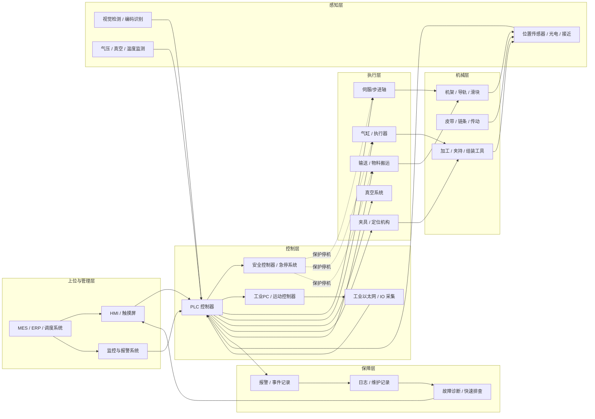

# 非标自动化设备架构总览

下面给出一个适用于非标自动化设备的典型系统架构概览，覆盖安全、控制、执行、检测和上位管理等核心模块。

## 架构说明

- 上位与管理层：负责生产指令、订单下发、监控和报警联动。
- 控制层：实现逻辑控制、运动控制、安全联锁和设备状态管理。
- 执行层：包括伺服轴、气缸、夹具、真空吸盘和输送机构等设备动作部件。
- 感知层：通过传感器和视觉系统反馈位置、状态、产品缺陷和工艺参数。
- 机械层：为设备提供结构支撑、运动路径、传动和工艺承载能力。
- 保障层：用于报警处理、日志归档、故障诊断和现场快速排查。

## 典型运行流程

1. 操作员或上位系统发出生产指令。
2. PLC 根据工艺逻辑和安全状态控制各执行器动作。
3. 传感器和视觉系统持续反馈实时状态。
4. 设备完成动作后，将结果反馈给 HMI 或 MES。
5. 若出现异常，安全系统优先停机并触发报警与维护记录。

## 建议扩展

- 增加 OPC UA / MQTT 接口，便于设备数据接入工业互联网平台。
- 增加在线诊断模块，用于趋势分析、故障预测和维护提醒。
- 建立标准化 I/O 点表和安全逻辑表，提升设备调试与维护效率。

